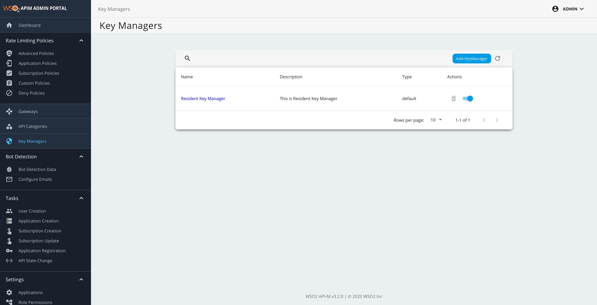
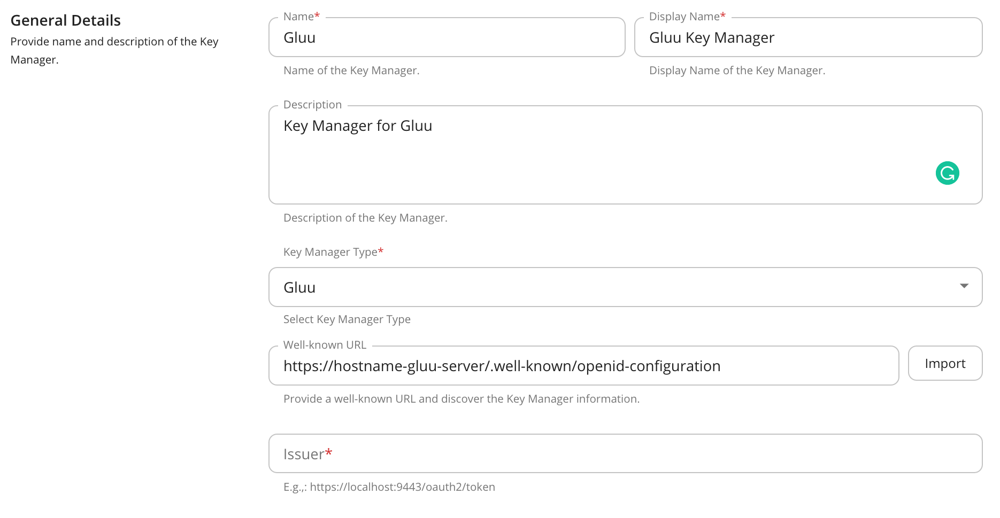
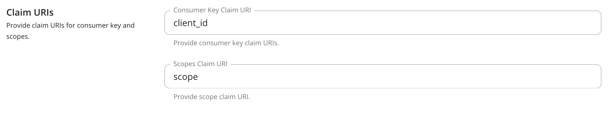
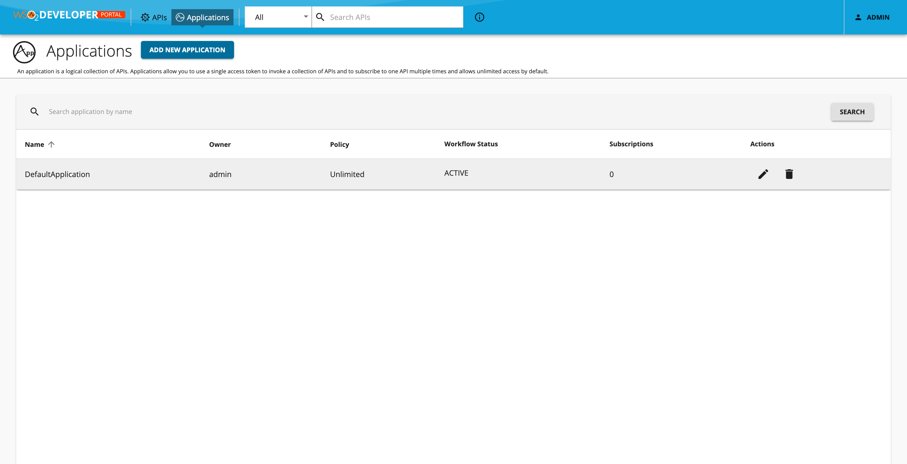
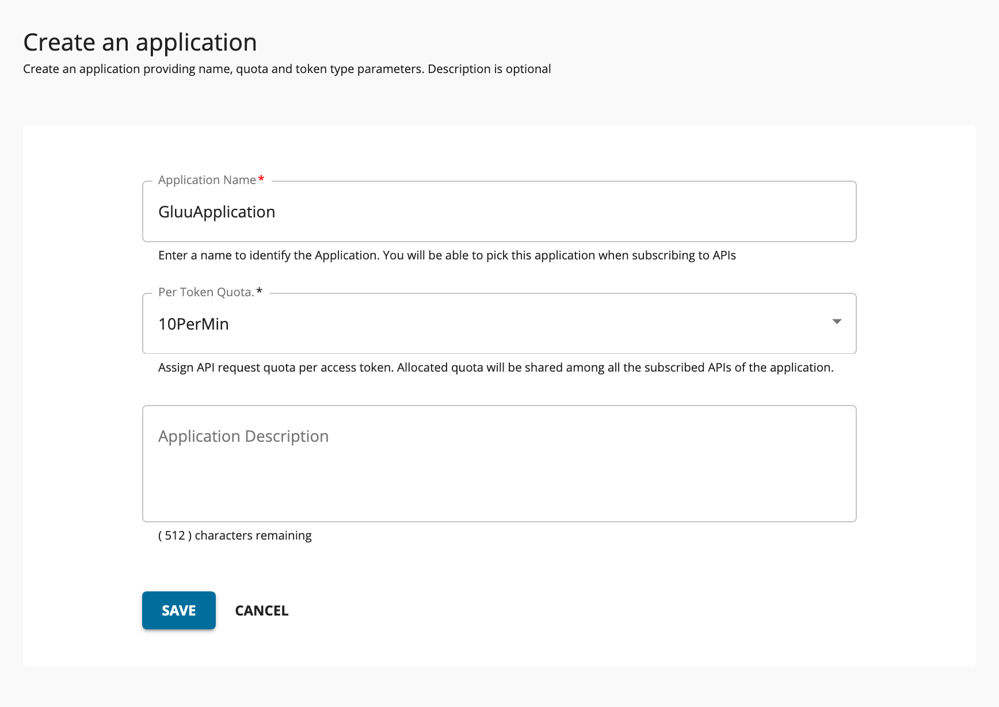
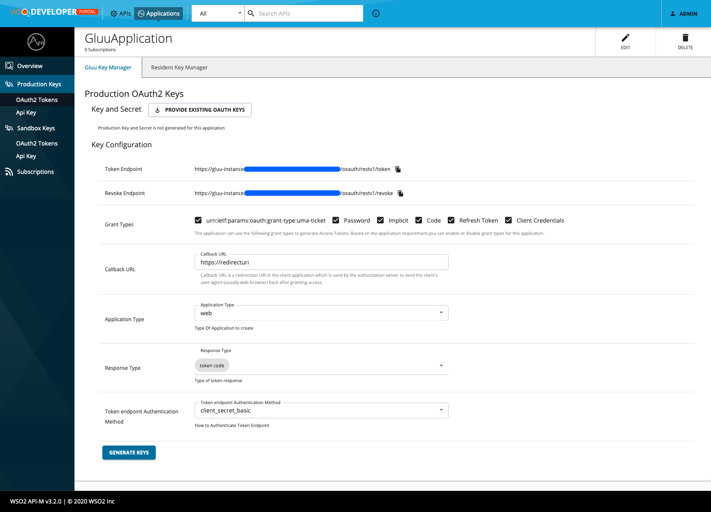

# Integrate Gluu with WSO2 API Manager

This guide explains how to integrate Gluu as third-party key manager with WSO2 API Manager (v3.2.0 onwards).

## Build & Deploy

> Please follow this section if you can't find any existing built JAR of the implementation in [Releases](https://github.com/athiththan11/apim-km-gluu/release) or if you are doing an active development

To build the project, execute the following `mvn` command from the root directory of the project

```sh
mvn clean install
```

After successful build, copy the built JAR artifact from `<apim-km-gluu>/components/gluu.key.manager/target` directory and place it inside the `<apim>/repository/components/dropins` directory of the WSO2 API Manager.

This requires a server restart to take effect on the changes and to enable the Gluu key manager component in WSO2 API Manager.

## Configure Gluu Server

Please follow the given instructions to configure the Gluu server to configure and integrate with WSO2 API Manager.

> The following configurations and instructions are illustrated given that the Gluu server is up and running in your preferred servers.

### Step 01: Enable Dynamic Client Registration

Login to the Gluu server and navigate to `Configuration` > `JSON Configuration` > `oXAuth Configuration` and scroll down to the `dynamicRegistrationEnabled` section and make it `true` and save the configurations to enable the Dynamic Client Registration feature.

### Step 02: OpenID Configuration Endpoint

Login to the Gluu server and navigate to `Configuration` > `JSON Configuration` > `oXAuth Configuration` screen and scroll to the `openIdConfigurationEndpoint` and make a note of the specified URL. The URL may follow the given format

```http
https://hostname-gluu-server/.well-known/openid-configuration
```

We will be using the OpenID Configuration endpoint URL to configure the key manager in WSO2 API Manager's Admin portal.

## Configure WSO2 API Manager

> Prior to following the configurations, please ensure to add the public certificate of the Gluu server to the `<apim>/repository/resources/security/client-truststore.jks` to overcome any SSL handshake errors during configurations

### Step 01: Add Gluu Key Manager

1. Login to the Admin portal ([/admin](https://localhost:9443/admin)) of the WSO2 API Manager, and click on `Key Managers` in the left-panel to add a new Key Manager. Then, click on `Add KeyManager` button and perform the following steps to configure the Gluu Key Manager in WSO2 API Manager

    

2. In the following screen, provide and fill the required details to configure the Key Manager.

    Fill the `Well-known URL` with the previously copied OpenID Configuration endpoint URL (from [here](#step-02-openid-configuration-endpoint)) and click on `Import` to import the required endpoint URLs of the Gluu server.

    > If you encounter into any SSL Handshake errors during the import action, please download and add the public cerificate of the Gluu server to the `<apim>/repository/resources/security/client-truststore.jks` to resolve the SSL errors

    

    As mentioned earlier, this will import and configure all required endpoints to configure the Gluu as a third-party key manager in the WSO2 API Manager.

3. Configure the values for `Consumer Key Claim URI` and `Scope Claim URI`

    Under the `Claim URIs` section, it is required to configure the claim URIs related to `Consumer Key` and `Scope`. The default values of Gluu server as follows

    - Consumer Key Claim URI: `client_id`
    - Scope Claim URI: `scope`

    

4. `Add` and save the configurations

### Step 02: Create Application & Generate Keys

1. Navigate to the Devportal ([/devportal](https://localhost:9443/devportal)) and click on `Sign-In` to login to the Devportal and then move to `Applications`.
2. Click on `ADD NEW APPLICATION` to create a new application

    

3. Fill the required information and click on `Save` to create an Application

    

4. In the following screen, go to `Production Keys` > `OAuth2 Tokens` and select the `Gluu Key Manager` tab and fill the information to create an application and to generate the keys and access token.

    

5. Click on `Generate Keys` to creat a client in the Gluu server and to generate the Consumer Key and Secret and a JWT access token.

### Generate Access Token with Scopes

If you have any APIs protected with scopes, then please follow the given instructions to configure the Gluu server to include and generate access token with the required scopes.

> **Assumption:** We have an existing API with a scope called `'menu'` engaged to one of the API resource

1. Login to the Gluu server and go to `OpenID Connect` > `Scopes` screen and click on `Add Scope` to create
2. Enter the scope name in the `Display Name` field and click on `Add` to save the scope
3. Then, navigate to `OpenID Connect` > `Clients` and open and edit the respective Gluu client that has been created in the Gluu server (respective to the Devportal Application)
4. Under the `Scopes` section, click on `Add Scope` and add the newly created `menu` scope to the list. This is to enable and allow the respective client to issue the respective scope when generating an Access Token
5. Once the scopes are updated, click on `Update` to update the Gluu client

Now, you can successfully generate the Access Token from Gluu server with the required scopes (ex: `menu`) and invoke the respective API in the API Manager server.
